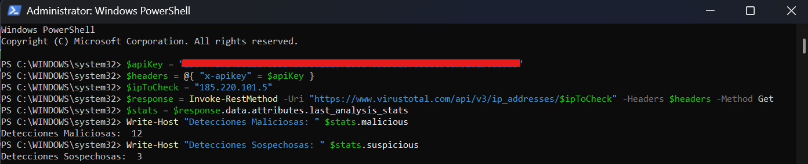

# SOAR Automated Threat Intelligence Ingestion & Triage Playbook

## Project Overview
This project demonstrates a **Security Orchestration, Automation, and Response (SOAR)** workflow to automate initial indicator triage. Using the **VirusTotal API v3**, the script ingests suspicious Network Indicators of Compromise (IP addresses, domain names, hashes), queries multi-engine threat intelligence databases, and returns automated malicious classification metrics for instant escalation.

## Automated Response Workflow
1. **Indicator Ingestion:** Receives an incoming suspicious IoC (e.g., external connection IP or email attachment hash).
2. **API Orchestration:** Constructs secure REST requests targeting the VirusTotal threat intelligence endpoint via API key authentication.
3. **Automated Triage & Verdict:** Parses JSON responses to quantify vendor malicious/suspicious detections automatically without manual analyst intervention.

## Key Evidence

### Automated Threat Intelligence Query Output

*Figure 1: PowerShell SOAR integration script executing automated VirusTotal REST API query and returning detection metrics.*

## Automated Triage Metrics

| Parameter | Configuration | Operational Value |
| :--- | :--- | :--- |
| **API Endpoint** | `https://www.virustotal.com/api/v3/` | Multi-engine reputation query |
| **Authentication** | Custom Header (`x-apikey`) | Secure API integration |
| **Target IoC** | `185.220.101.5` | Known malicious relay / scanner IP |
| **Parsed Fields** | `last_analysis_stats.malicious` | Rapid automated escalation trigger |

## Key Competencies Demonstrated
* **SOAR & Security Automation:** Automating repetitive SOC Level 1 enrichment tasks to minimize Mean Time to Detect (MTTD).
* **API Integration:** Interfacing with external Threat Intelligence platforms using REST APIs and JSON payload parsing.
* **Incident Response Escalation:** Designing programmatic logic to classify indicators based on threat vendor consensus.
